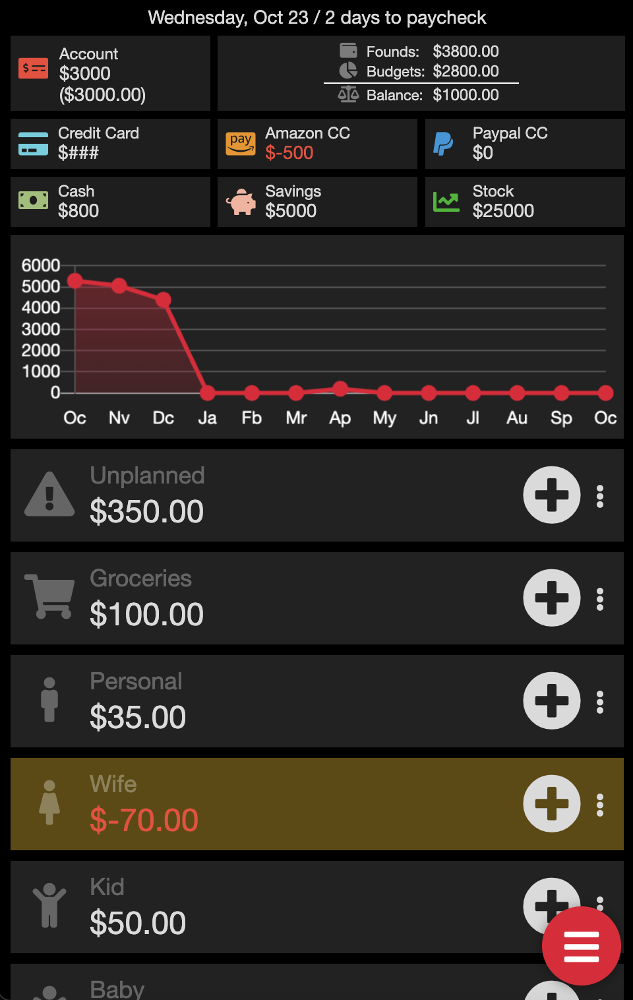

# Finance React - Personal Finance Tracking System

## Description
This project began in 2018 shortly after I got married, with the goal of creating a collaborative system for tracking expenses with my wife. Initially, I developed it using jQuery for the frontend and PHP for the backend, allowing us to have a custom-tailored tool to manage and monitor our finances.

As our needs evolved, I continuously updated the app to make expense tracking more intuitive and user-friendly. In 2023, I decided to transition the application to React, taking advantage of its modern capabilities to improve performance, scalability, and user experience.

You can see the live version here although it has dummy data for privacy reasons.
finance.visssible.com

## Built With
- React.js
- Chart.js 
- Axios

## Features
-  Responsive design: Optimized for both mobile and desktop views, ensuring an optimal experience on any screen size.
-  Monthly charts: Visualize income and expenses over the last 12 months using Chart.js.
-  Advanced search: Perform detailed searches using multiple parameters to easily find specific transactions.
-  Multiple budgets and payment methods: Manage various budgets and track expenses across different payment methods.
-  Real-time API calls: Fetch user and order data dynamically using real-time API integrations.
-  Reusable components: Built with modular and reusable React components for efficiency and scalability.

## Screenshots

